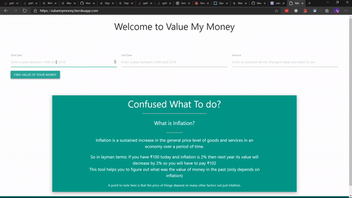

# Value My Money
### This tool helps you to see how much the value of money has changed due to inflation 
This tool uses inflation data set from <a href="https://www.macrotrends.net/"> Macrotrends </a> and calculated the results compoundly. 

## Use the tool
### <a href="https://valuemymoney.herokuapp.com/"> ValueMyMoney </a>

## What I have used?
- Django 
- Heroku
- Pandas
- Dataset from <a href="https://www.macrotrends.net/"> Macrotrends </a>
- Materialize CSS
- Chart JS

## Do tell me what you think about this tool😉
